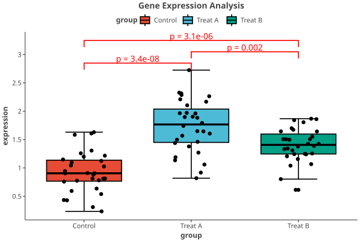
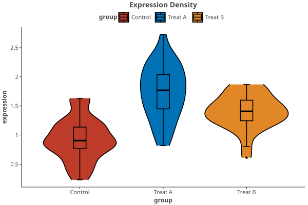
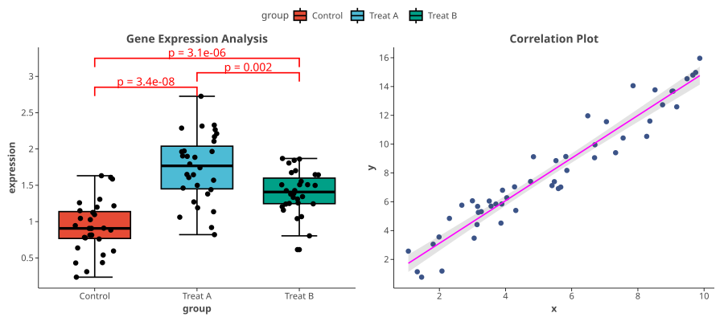

# letspubpy 📊

A publication-ready plotting library that wraps **Lets-Plot** in Python, mimicking the design and high-level simplicity of R's famous **ggpubr** package.

`letspubpy` simplifies creation of journal-quality scientific plots (such as box plots, violin plots, and bar charts) with automated statistical comparisons, publication color palettes, and easy grid arrangements, while maintaining full compatibility with the grammar of graphics under Lets-Plot.

---

## Key Features

- **High-Level Plots**: Build complex boxplots, violin plots, raincloud plots, dotplots, line plots, and pie charts with simple, intuitive functions (`ggboxplot`, `ggviolin`, `ggraincloud`, `ggbarplot`, `ggscatter`, `ggpie`, etc.).
- **Omics & Bioinformatics**: Differential expression volcano plots (`ggvolcano`), GWAS Manhattan plots (`ggmanhattan`), UpSet set intersection charts (`ggupset`), GSEA running enrichment score curves (`visGSEA`), pathway enrichment lollipop charts (`visEnrichLollipop`), and clustered pathway-gene concept networks (`visEnrichNetwork` / `cnetplot`).
- **Clinical & Statistical Modeling**: Kaplan-Meier survival curves with automated log-rank tests and Greenwood 95% CIs (`ggsurvplot`), Meta-analysis / Cox regression forest plots (`ggforest`), ROC & Precision-Recall curves with AUC calculation (`ggroc`), RECIST oncology waterfall plots (`ggwaterfall`), Bland-Altman agreement plots (`ggblandaltman`), and multi-metric radar charts (`ggradar`).
- **Pharmacology & 4PL Fitting**: Non-linear sigmoidal dose-response IC50/EC50 estimation and visualization (`ggdoseresponse` / `ggic50`).
- **Heatmaps & Clustered Heatmaps**: Create publication-ready heatmaps with row/column hierarchical clustering, Z-score standardization, value annotations, and journal gradients (`ggheatmap`, `ggclustervis`, `ggclustergram`).
- **Cluster Expression Dynamics (`visCluster`)**: ClusterGVis-style multi-panel visualization combining clustered heatmaps with smoothed cluster trajectory trend lines.
- **Single-Cell Pseudotime Heatmaps (`visPseudotime`)**: Monocle-style trajectory heatmaps along cell differentiation continuum with built-in simulation tools.
- **Automatic Statistics (`+ stat_compare_means`)**: Easily calculate and annotate plots with statistical test brackets (Welch's t-test, Mann-Whitney U / Wilcoxon, ANOVA, Kruskal-Wallis) using Python's `scipy.stats`.
- **Journal Color Palettes**: Directly apply color schemes matching top journals like Nature (`npg`), Science (`aaas`), NEJM (`nejm`), JAMA (`jama`), Lancet (`lancet`), and JCO (`jco`).
- **Flexible Grid Layouts (`ggarrange`)**: Combine multiple plots into a clean subplot panel with a unified legend.
- **Fluent Integration**: Seamlessly extends Lets-Plot; you can still use the standard `+` operator to add native geoms, scales, facets, and labels.

---

## Installation

You can install `letspubpy` in your project with `uv` or `pip`:

```bash
# Install directly from the local folder
pip install .

# Or with uv
uv add .
```

### Install from GitHub Releases
You can download the pre-built wheel (`.whl`) or source distribution from the [GitHub Releases Page](https://github.com/xpf10/letspubpy/releases) and install it directly:

```bash
# Install from the downloaded wheel
pip install letspubpy-0.1.0-py3-none-any.whl

# Or install directly via the release download URL
pip install https://github.com/xpf10/letspubpy/releases/download/v0.1.0/letspubpy-0.1.0-py3-none-any.whl
```

---

## Quick Start & Examples

Here is a quick overview of how to build publication-grade plots in Python:

### 1. High-Level Boxplots with Statistical Comparisons

```python
import pandas as pd
import numpy as np
import letspubpy as lpp

# Create sample dataset
np.random.seed(42)
df = pd.DataFrame({
    'group': ['Control'] * 30 + ['Treat A'] * 30 + ['Treat B'] * 30,
    'expression': np.concatenate([
        np.random.normal(loc=1.0, scale=0.4, size=30),
        np.random.normal(loc=1.8, scale=0.5, size=30),
        np.random.normal(loc=1.4, scale=0.3, size=30)
    ])
})

# Create boxplot with individual jitter points, publication colors, and Wilcoxon tests
p = lpp.ggboxplot(
    df, x='group', y='expression',
    fill='group', palette='npg', 
    add='jitter', title="Gene Expression Analysis"
) + lpp.stat_compare_means(
    comparisons=[('Control', 'Treat A'), ('Treat A', 'Treat B'), ('Control', 'Treat B')],
    method='wilcoxon',
    color='red'
)

# Render or save
p.show()
```



### 2. Violin Plots with Inner Boxplots

```python
# Create violin plot with an embedded boxplot and NEJM color scheme
p_violin = lpp.ggviolin(
    df, x='group', y='expression',
    fill='group', palette='nejm',
    add='boxplot', title="Expression Density"
)
p_violin.show()
```



### 3. Clustered Gene Expression Heatmap (`ggclustervis` / `ggheatmap`)

```python
# Create numeric expression matrix
genes = [f"Gene_{i+1}" for i in range(12)]
samples = [f"Ctrl_{j+1}" for j in range(4)] + [f"Treat_{j+1}" for j in range(4)]
mat = pd.DataFrame(np.random.randn(12, 8), index=genes, columns=samples)

# Hierarchically clustered heatmap with row Z-score scaling and publication palette
p_heat = lpp.ggclustervis(
    mat,
    scale="row",
    cluster_rows=True,
    cluster_cols=True,
    palette="bwr",
    title="Clustered Gene Expression Heatmap",
    xlab="Samples",
    ylab="Genes"
)
p_heat.show()
```

### 4. ClusterGVis Dual-View Expression Dynamics (`visCluster`)

```python
# Multi-time-point gene expression dynamics (24 genes x 6 time points)
timepoints = ["0h", "2h", "6h", "12h", "24h", "48h"]
t = np.linspace(0, 2 * np.pi, 6)
data = [np.sin(t) + np.random.normal(0, 0.2, 6) if i < 12 else np.cos(t) + np.random.normal(0, 0.2, 6) for i in range(24)]
df_mat = pd.DataFrame(data, index=[f"Gene_{i+1:02d}" for i in range(24)], columns=timepoints)

# Dual-view split: left cluster trend lines + right clustered heatmap
p_cluster = lpp.visCluster(
    df_mat,
    n_clusters=4,
    scale="row",
    plot_type="both",
    trend_position="left",
    palette="bwr",
    cluster_palette="npg",
    title="ClusterGVis Expression Dynamics"
)
p_cluster.show()
```

### 5. Combining Plots into a Layout (`ggarrange`)

```python
# Create a scatter plot with a linear regression fit
x_val = np.random.uniform(1, 10, size=50)
y_val = x_val * 1.5 + np.random.normal(0, 1.2, size=50)
df_scatter = pd.DataFrame({'x': x_val, 'y': y_val})

p_scatter = lpp.ggscatter(
    df_scatter, x='x', y='y',
    color='#3C5488', add='reg.line',
    title="Correlation Plot"
)

# Combine the box plot and scatter plot in a 1-row, 2-column grid
grid = lpp.ggarrange(
    p, p_scatter,
    ncol=2, common_legend=True, legend='bottom'
)
grid.show()
```



### 6. Customizing Themes & Fonts

You can use `letspubpy`'s built-in `theme_pubr()` or any of Lets-Plot's standard themes (like `theme_minimal()`, `theme_bw()`, `theme_classic()`, `theme_void()`, etc.) in two ways:

#### A. Pass the theme to the plotting function directly:
```python
# Pass theme_minimal() using the ggtheme parameter
p_minimal = lpp.ggboxplot(
    df, x='group', y='expression',
    fill='group', palette='npg', 
    ggtheme=lpp.theme_minimal()
)
p_minimal.show()
```

#### B. Override using the `+` operator:
```python
# Create with default theme_pubr() and override using the standard + operator
p_bw = lpp.ggboxplot(df, x='group', y='expression', fill='group') + lpp.theme_bw()
p_bw.show()
```

---

## API Documentation

### Standard Plotting Functions
All plotting functions support standard parameters (`color`, `fill`, `palette`, `title`, `xlab`, `ylab`, `show_legend`, `ggtheme`):
- `ggboxplot(data, x, y, notch=False, add="none", ...)`: Create a boxplot. `add` can be `"jitter"`, `"dotplot"`, or `"point"`.
- `ggviolin(data, x, y, draw_quantiles=None, add="none", ...)`: Create a violin plot. `add` can be `"boxplot"`, `"jitter"`, or `"dotplot"`.
- `ggraincloud(data, x, y, ...)`: Create a modern raincloud plot (half-violin + boxplot + jittered points).
- `ggbarplot(data, x, y=None, add="none", ...)`: Create a bar chart showing counts or group means with automated error bars (`"mean_se"`, `"mean_sd"`).
- `ggline(data, x, y, add="none", ...)`: Create a line plot of group means.
- `ggscatter(data, x, y, add="none", ...)`: Create a scatter plot with regression fits and confidence ellipses.
- `gghistogram(data, x, y="..count..", bins=30, ...)`: Create a histogram.
- `ggdensity(data, x, y="..density..", ...)`: Create a density curve.
- `ggpie(data, x, label, fill=None, hole=0, ...)`: Create a pie chart.
- `ggdonutchart(data, x, label, fill=None, hole=0.4, ...)`: Create a donut chart.
- `ggqqplot(data, x, ...)`: Create a Q-Q plot with theoretical reference line.
- `ggecdf(data, x, ...)`: Create an empirical cumulative distribution function (ECDF) plot.
- `ggcorr(data, method="pearson", digits=2, ...)`: Create a correlation matrix heatmap with significance stars.

### Omics & Bioinformatics Visualizations
- `ggvolcano(data, fc_cutoff=1.0, p_cutoff=0.05, top_n=10, ...)`: Differential expression volcano plot with threshold lines and top gene labels.
- `ggmanhattan(data, suggestive_line=1e-5, genomewide_line=5e-8, ...)`: GWAS Manhattan plot with alternating chromosome colors.
- `ggupset(data, sets=None, min_size=1, top_n=12, ...)`: UpSet plot for multi-set intersection overlaps.
- `visGSEA(res_data, term, rnk=None)` / `gsea_plot(...)` / `blitzgsea_plot(...)`: GSEA running enrichment score plot with hit barcode heatmap ribbon.
- `visEnrichLollipop(data, top_n=10, x="RichFactor", ...)`: Pathway enrichment analysis lollipop chart.
- `visEnrichNetwork(data, top_n=9, cluster_pathways=True, show_hulls=True, ...)` / `cnetplot(...)`: Clustered pathway-gene concept network with convex hull boundaries.
- `ggheatmap(data, scale="none", cluster_rows=False, cluster_cols=False, ...)`: Heatmap with optional hierarchical clustering and Z-score scaling.
- `ggclustervis(data, ...)` / `ggclustergram(data, ...)`: Hierarchically clustered heatmap.
- `visCluster(data, n_clusters=4, plot_type="both", ...)`: ClusterGVis-style dual view (clustered heatmap + trend lines).
- `visPseudotime(data, n_clusters=4, ...)`: Monocle-style single-cell pseudotime trajectory heatmap.

### Clinical & Statistical Modeling Visualizations
- `ggsurvplot(data, time="time", status="status", group="group", log_rank=True, conf_int=True, ...)`: Kaplan-Meier survival curves with log-rank test $p$-value and Greenwood 95% CIs.
- `ggforest(data, study="study", mean="mean", lower="lower", upper="upper", ...)`: Meta-analysis & Cox/Logistic regression forest plot with aligned labels.
- `ggroc(data, y_true="y_true", y_score="y_score", plot_type="roc", ...)`: ROC & Precision-Recall curves with automated AUC computation and optimal cutoff detection.
- `ggdoseresponse(data, dose="dose", response="response", ...)` / `ggic50(...)`: Sigmoidal 4PL dose-response IC50/EC50 non-linear curve fitting.
- `ggwaterfall(data, x="patient", y="change", group="response", ...)`: Oncology RECIST tumor burden waterfall plot.
- `ggblandaltman(data, x="Method_A", y="Method_B", ...)`: Bland-Altman method agreement plot with Mean Bias and 95% Limits of Agreement.
- `ggradar(data, id="entity", ...)`: Multi-dimensional polygonal radar / spider chart.

### Themes & Color Palettes
- `theme_pubr(base_size=12, base_family=None, legend="top", border=False)`: Custom clean publication-ready theme.
- `scale_color_pubr(palette="npg")` & `scale_fill_pubr(palette="npg")`: Use journal color palettes (`npg`, `aaas`, `nejm`, `jama`, `jco`, `lancet`, `locuszoom`, `simpsons`, `tron`).
- `theme_prism(palette="black_and_white", base_size=14, base_family="sans", base_fontface="bold", border=False)`: Custom GraphPad Prism-like theme.
- `scale_color_prism(palette="colors")`, `scale_fill_prism(palette="colors")`, & `scale_shape_prism(palette="default")`: GraphPad Prism-like color, fill, and shape scales.

### Statistics & Layouts
- `stat_compare_means(comparisons=None, method="wilcoxon", paired=False, label="p.format", size=None, symnum_args=None, ...)`: Add statistical significance brackets (if `comparisons` is provided) or a global label (ANOVA/Kruskal-Wallis) to the plot.
  - `size`: Configure the font size of the significance labels.
  - `symnum_args`: Customize significance thresholds/symbols via a dict, e.g. `{"cutpoints": [0, 0.01, 1], "symbols": ["significant", "ns"]}`.
  - `label`: Can be `"p.format"`, `"p.signif"`, or a list of custom string labels matching the comparisons (e.g. `["Group A vs B", "Group B vs C"]`).
- `ggarrange(*plots, ncol=None, nrow=None, common_legend=False, legend="bottom")`: Combine multiple plots on a grid.

---

## License

This project is licensed under the MIT License.
