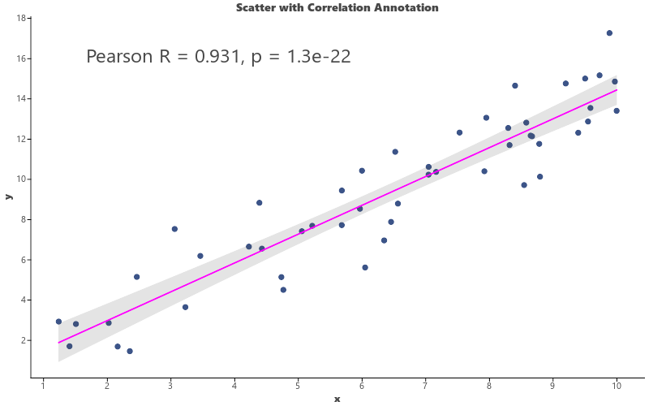
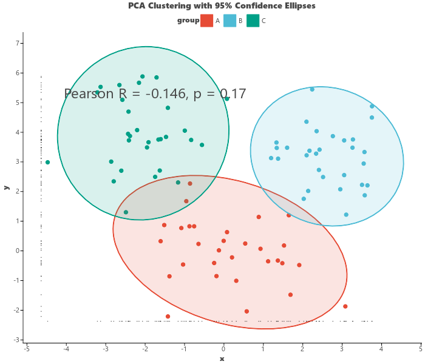
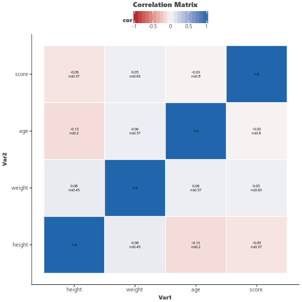

# Examples

Complete examples demonstrating letspubpy's capabilities.

## Example 1: Boxplot with Statistical Comparisons

```python
import pandas as pd
import numpy as np
import letspubpy as lpp

np.random.seed(42)
df = pd.DataFrame({
    'group': ['Control'] * 30 + ['Treat A'] * 30 + ['Treat B'] * 30,
    'expression': np.concatenate([
        np.random.normal(1.0, 0.4, 30),
        np.random.normal(1.8, 0.5, 30),
        np.random.normal(1.4, 0.3, 30)
    ])
})

p = lpp.ggboxplot(
    df, x='group', y='expression',
    fill='group', palette='npg',
    add='jitter', title="Gene Expression Analysis"
) + lpp.stat_compare_means(
    comparisons=[('Control', 'Treat A'), ('Treat A', 'Treat B')],
    method='wilcoxon', color='red'
)
p.show()
```


## Example 2: Violin Plot with Embedded Boxplot

```python
p = lpp.ggviolin(
    df, x='group', y='expression',
    fill='group', palette='nejm',
    add='boxplot', title="Expression Density"
)
p.show()
```


## Example 3: Scatter Plot with Regression and Correlation

```python
np.random.seed(42)
x = np.random.uniform(1, 10, 50)
y = x * 1.5 + np.random.normal(0, 1.5, 50)
df_scatter = pd.DataFrame({'x': x, 'y': y})

p = lpp.ggscatter(
    df_scatter, x='x', y='y',
    color='#3C5488',
    add='reg.line', confint=True,
    title="Correlation Plot"
) + lpp.stat_cor(method='pearson', size=12)
p.show()
```



## Example 4: Multi-panel Figure

```python
# Create individual plots
p_box = lpp.ggboxplot(df, x='group', y='expression',
                      fill='group', palette='npg', add='jitter')
p_violin = lpp.ggviolin(df, x='group', y='expression',
                        fill='group', palette='npg', add='boxplot')
p_hist = lpp.gghistogram(df, x='expression', fill='#3C5488', bins=20)
p_scatter = lpp.ggscatter(df_scatter, x='x', y='y',
                          color='#3C5488', add='reg.line')

# Combine in a 2x2 grid
grid = lpp.ggarrange(
    p_box, p_violin, p_hist, p_scatter,
    ncol=2, nrow=2
)
grid.show()
```

## Example 5: PCA Clustering with Confidence Ellipses

```python
np.random.seed(42)
n = 30
X = np.vstack([
    np.random.multivariate_normal([0, 0], [[1, 0.3], [0.3, 1]], size=n),
    np.random.multivariate_normal([3, 3], [[1, -0.2], [-0.2, 1]], size=n),
    np.random.multivariate_normal([-2, 4], [[1, 0.1], [0.1, 1]], size=n),
])
df_pca = pd.DataFrame(X, columns=['PC1', 'PC2'])
df_pca['group'] = ['A'] * n + ['B'] * n + ['C'] * n

p = lpp.ggscatter(
    df_pca, x='PC1', y='PC2',
    color='group', fill='group',
    palette='npg', size=3,
    ellipse=True, ellipse_level=0.95, ellipse_type='norm',
    ellipse_alpha=0.15,
    rug=True, cor=True, cor_method='pearson', cor_size=12,
    title="PCA Clustering with 95% Confidence Ellipses"
)
p.show()
```



## Example 6: Correlation Heatmap

```python
np.random.seed(42)
df_corr = pd.DataFrame({
    'height': np.random.normal(170, 10, 100),
    'weight': np.random.normal(70, 15, 100),
    'age': np.random.normal(30, 5, 100),
    'score': np.random.normal(80, 10, 100),
})

p = lpp.ggcorr(
    df_corr, method='pearson',
    p_low='*', p_high='ns',
    title="Correlation Matrix"
)
p.show()
```



## Example 7: Customizing with rremove and ggpar

```python
p = lpp.ggboxplot(df, x='group', y='expression',
                  fill='group', palette='npg',
                  title="My Plot", xlab="Groups", ylab="Values")

# Remove title and x-axis label
p = lpp.rremove(p, 'title')
p = lpp.rremove(p, 'xlab')

# Or customize with ggpar
p = lpp.ggpar(p, title="New Title", palette='nejm', legend='top')
```

## Example 8: Publication Clustered Heatmap

```python
np.random.seed(42)
genes = [f"Gene_{i+1}" for i in range(12)]
samples = [f"Sample_{j+1}" for j in range(8)]
mat = pd.DataFrame(np.random.randn(12, 8), index=genes, columns=samples)

p_heatmap = lpp.ggclustervis(
    mat,
    scale="row",
    cluster_rows=True,
    cluster_cols=True,
    palette="bwr",
    title="Clustered Expression Heatmap",
    xlab="Samples",
    ylab="Genes"
)
p_heatmap.show()
```

## Example 9: ClusterGVis Dual-View Expression Dynamics

```python
# 24 genes x 6 time points
timepoints = ["0h", "2h", "6h", "12h", "24h", "48h"]
t = np.linspace(0, 2 * np.pi, 6)
data = []
for i in range(24):
    pattern = np.sin(t) if i < 6 else (np.cos(t) if i < 12 else (np.exp(-t) if i < 18 else 1 - np.exp(-t)))
    data.append(pattern + np.random.normal(0, 0.2, 6))

df_mat = pd.DataFrame(data, index=[f"Gene_{i+1:02d}" for i in range(24)], columns=timepoints)

p_viscluster = lpp.visCluster(
    df_mat,
    n_clusters=4,
    scale="row",
    plot_type="both",
    trend_position="left",
    palette="bwr",
    cluster_palette="npg",
    title="ClusterGVis Expression Dynamics"
)
p_viscluster.show()
```

## Example 10: Single-Cell Pseudotime Trajectory Heatmap

```python
# Simulate and plot Monocle-style pseudotime trajectory heatmap
df_pseudo = lpp.sim_pseudotime_data(n_genes=80, n_pts=40, n_clusters=4)

p_pseudo = lpp.visPseudotime(
    data=df_pseudo,
    n_clusters=4,
    scale="row",
    palette="bwr",
    cluster_palette="npg",
    title="Single-Cell Pseudotime Trajectory Heatmap"
)
p_pseudo.show()
```

## Example 11: GSEA and Pathway Enrichment

```python
# GSEA Running Enrichment Plot
res_data, term, rnk = lpp.sim_gsea_data(n_genes=120, n_hits=15, nes=1.92, term="KEGG_CELL_CYCLE")
p_gsea = lpp.visGSEA(res_data, term=term, rnk=rnk)
p_gsea.show()

# Pathway Enrichment Lollipop
df_enrich = lpp.sim_enrichment_data(n_terms=10)
p_lollipop = lpp.visEnrichLollipop(df_enrich, top_n=8, title="Pathway Enrichment Lollipop")
p_lollipop.show()

# Clustered Concept Network (cnetplot)
p_network = lpp.visEnrichNetwork(df_enrich, top_n=5, cluster_pathways=True, show_hulls=True)
p_network.show()
```

## Example 12: Volcano Plot for RNA-seq

```python
p_volcano = lpp.ggvolcano(
    fc_cutoff=1.0,
    p_cutoff=0.05,
    top_n=10,
    title="Differential Expression Volcano Plot"
)
p_volcano.show()
```

## Example 13: Multimodal Distribution Raincloud Plot

```python
p_raincloud = lpp.ggraincloud(
    palette="npg",
    title="Multimodal Raincloud Plot"
)
p_raincloud.show()
```

## Example 14: Kaplan-Meier Survival Analysis

```python
p_surv = lpp.ggsurvplot(
    time="time",
    status="status",
    group="group",
    palette="npg",
    conf_int=True,
    log_rank=True,
    title="Kaplan-Meier Overall Survival Curve"
)
p_surv.show()
```

## Example 15: Meta-Analysis Forest Plot

```python
p_forest = lpp.ggforest(
    title="Meta-Analysis Forest Plot"
)
p_forest.show()
```

## Example 16: Multi-Model ROC Diagnostic Comparison

```python
p_roc = lpp.ggroc(
    plot_type="roc",
    show_auc=True,
    mark_optimal=True,
    title="Multi-Model ROC Diagnostic Comparison"
)
p_roc.show()
```

## Example 17: Sigmoidal 4PL Dose-Response IC50 Curve

```python
p_ic50 = lpp.ggdoseresponse(
    dose="dose",
    response="response",
    show_ic50=True,
    title="Sigmoidal 4PL Dose-Response IC50 Curve"
)
p_ic50.show()
```


