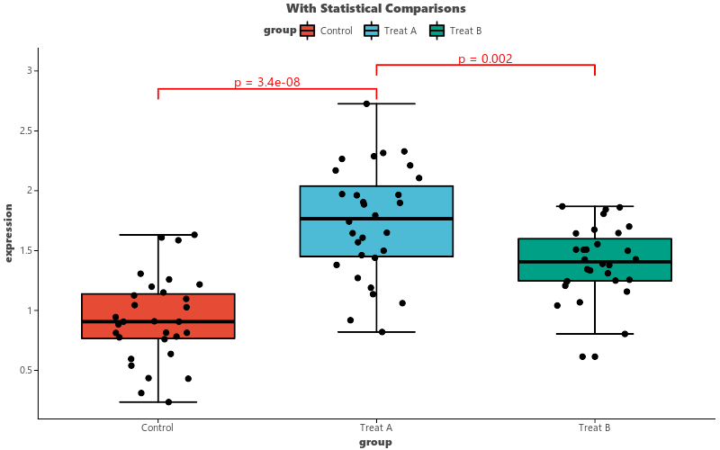

# letspubpy

<div align="center">
  <h3>A publication-ready plotting library for Python</h3>
  <p>
    <a href="https://github.com/xpf10/letspubpy">
      
    </a>
    <a href="https://pypi.org/project/letspubpy/">
      
    </a>
    
  </p>
  <p><em>Mimicking the design and high-level simplicity of R's ggpubr, powered by Lets-Plot.</em></p>
</div>

---

## 📊 Overview

**letspubpy** simplifies creation of journal-quality scientific plots (such as box plots, violin plots, and bar charts) with automated statistical comparisons, publication color palettes, and easy grid arrangements, while maintaining full compatibility with the grammar of graphics under [Lets-Plot](https://lets-plot.org/).

### ✨ Key Features

- **High-Level Plots**: Build complex boxplots, violin plots, dotplots, line plots, and pie charts with simple, intuitive functions
- **Heatmaps & Clustered Heatmaps**: Create publication-ready heatmaps with row/column hierarchical clustering, Z-score standardization, value annotations, and journal gradients (`ggheatmap`, `ggclustervis`)
- **Cluster Expression Dynamics (`visCluster`)**: ClusterGVis-style multi-panel visualization combining clustered heatmaps with smoothed cluster trajectory trend lines
- **Single-Cell Pseudotime Heatmaps (`visPseudotime`)**: Monocle-style trajectory heatmaps along cell differentiation continuum with built-in simulation tools
- **GSEA & Pathway Enrichment**: GSEA running score plots (`visGSEA`), pathway enrichment lollipop charts (`visEnrichLollipop`), and clustered concept networks (`visEnrichNetwork` / `cnetplot`)
- **Automatic Statistics**: Easily calculate and annotate plots with statistical test brackets (Welch's t-test, Mann-Whitney U / Wilcoxon, ANOVA, Kruskal-Wallis)
- **Journal Color Palettes**: Directly apply color schemes matching top journals (Nature, Science, NEJM, JAMA, Lancet, JCO)
- **Flexible Grid Layouts**: Combine multiple plots into a clean subplot panel with a unified legend
- **Statistical Annotations**: Add correlation coefficients, regression equations, and more
- **Fluent Integration**: Seamlessly extends Lets-Plot; you can still use the standard `+` operator

### 🚀 Quick Example

```python
import pandas as pd
import numpy as np
import letspubpy as lpp

np.random.seed(42)
df = pd.DataFrame({
    'group': ['Control'] * 30 + ['Treat A'] * 30 + ['Treat B'] * 30,
    'expression': np.concatenate([
        np.random.normal(1.0, 0.4, 30),
        np.random.normal(1.8, 0.5, 30),
        np.random.normal(1.4, 0.3, 30)
    ])
})

p = lpp.ggboxplot(
    df, x='group', y='expression',
    fill='group', palette='npg',
    add='jitter', title="Gene Expression Analysis"
) + lpp.stat_compare_means(
    comparisons=[('Control', 'Treat A'), ('Treat A', 'Treat B')],
    method='wilcoxon', color='red'
)

p.show()
```



---

## 📚 Documentation Sections

| Section | Description |
|---------|-------------|
| [Getting Started](getting-started.md) | Installation and first plot |
| [Examples](examples.md) | Usage examples with code |
| [Plot Types](plots/boxplot.md) | All supported plot types |
| [Statistical Annotations](stats/compare-means.md) | Adding p-values, correlations |
| [Themes & Palettes](themes-and-palettes.md) | Customizing colors and appearance |
| [Layout & Utilities](layout-and-utilities.md) | Grid arrangements, plot helpers |
| [API Reference](api-reference.md) | Complete function reference |

---

## 📦 Installation

```bash
pip install letspubpy
```

Or from source:

```bash
pip install -e .
```

---

## 📄 License

This project is licensed under the MIT License.
