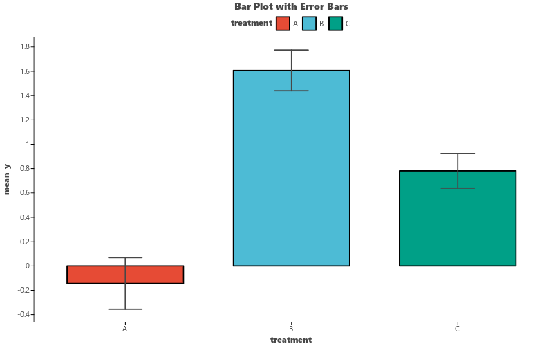

# Bar Plot

Create bar charts showing counts or group means, with optional error bars.

## Basic Usage

```python
import pandas as pd
import numpy as np
import letspubpy as lpp

np.random.seed(42)
df = pd.DataFrame({
    'group': ['A'] * 30 + ['B'] * 30 + ['C'] * 30,
    'value': np.concatenate([
        np.random.normal(0, 1, 30),
        np.random.normal(1.5, 1, 30),
        np.random.normal(0.5, 1, 30)
    ])
})

# Bar chart of counts (no y column)
p = lpp.ggbarplot(df, x='group', fill='group', palette='npg')
p.show()

# Bar chart of means
p = lpp.ggbarplot(df, x='group', y='value', fill='group', palette='npg')
```

## Adding Error Bars

```python
# Mean ± SEM
p = lpp.ggbarplot(
    df, x='group', y='value',
    fill='group', palette='npg',
    add='mean_se'
)

# Mean ± SD
p = lpp.ggbarplot(
    df, x='group', y='value',
    fill='group', palette='npg',
    add='mean_sd'
)
```



## API

::: letspubpy.plots.ggbarplot
    options:
        show_source: true

