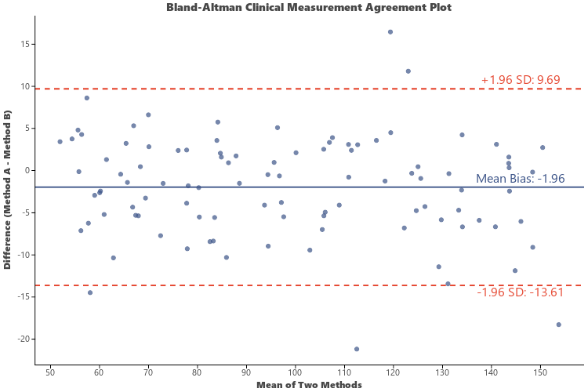

# Bland-Altman Agreement Plot (`ggblandaltman`)

`ggblandaltman` (aliased as `visBlandAltman`) creates **Bland-Altman Agreement Plots** for method comparison, medical device calibration, and clinical measurement agreement analysis.

---

## Key Features

- **Mean Difference (Bias)**: Solid central line indicating systematic measurement bias ($\bar{d}$).
- **95% Limits of Agreement (LOA)**: Upper and lower dashed lines representing $\bar{d} \pm 1.96 \times \text{SD}$.
- **Unit & Percentage Difference**: Supports raw numerical difference or percentage difference relative to mean values (`percent_diff=True`).

---

## Usage Examples

### 1. Basic Bland-Altman Plot

```python
import letspubpy as lpp

# Simulate and plot clinical method agreement
p = lpp.ggblandaltman(
    x="Method_A",
    y="Method_B",
    title="Bland-Altman Clinical Measurement Agreement Plot",
    xlab="Mean of Two Methods",
    ylab="Difference (Method A - Method B)"
)
p.show()
```



---

### 2. Percentage Difference Comparison

```python
import pandas as pd
import numpy as np
import letspubpy as lpp

np.random.seed(42)
true_conc = np.random.uniform(20, 200, 60)
df_devices = pd.DataFrame({
    "Device_1": true_conc + np.random.normal(0, 3, 60),
    "Device_2": true_conc * 1.03 + np.random.normal(0, 4, 60)
})

p_percent = lpp.ggblandaltman(
    df_devices,
    x="Device_1",
    y="Device_2",
    percent_diff=True,
    title="Relative Percentage Agreement between Devices"
)
p_percent.show()
```

---

## API Reference

### ggblandaltman

::: letspubpy.plots.ggblandaltman
    options:
        show_source: true

### sim_blandaltman_data

::: letspubpy.plots.sim_blandaltman_data
    options:
        show_source: true
