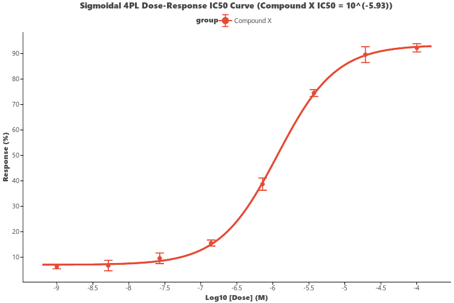

# Dose-Response & IC50 Fitting (`ggdoseresponse`)

`ggdoseresponse` (aliased as `ggic50` and `visDoseResponse`) provides non-linear **Sigmoidal 4-Parameter Logistic (4PL)** curve fitting and plotting, mimicking GraphPad Prism's standard pharmacology assay workflows.

---

## Key Features

- **4-Parameter Logistic (4PL) Model**:
  $$y = \text{Bottom} + \frac{\text{Top} - \text{Bottom}}{1 + 10^{(\log\text{IC}_{50} - x) \cdot \text{HillSlope}}}$$
- **Automated IC50 / EC50 Estimation**: Computes best-fit parameters, $R^2$, and Hill slope using SciPy's non-linear least squares solver (`show_ic50=True`).
- **Mean $\pm$ SE Data Aggregation**: Automatically aggregates experimental replicate measurements into mean points and error bars.
- **Log Transformation**: Built-in automatic $\log_{10}(\text{dose})$ scaling (`log_transform=True`).

---

## Usage Examples

### 1. Basic Dose-Response IC50 Curve

```python
import letspubpy as lpp

# Simulate drug dose-response assay and fit 4PL curve
p = lpp.ggdoseresponse(
    dose="dose",
    response="response",
    log_transform=True,
    show_ic50=True,
    palette="npg",
    title="Sigmoidal 4PL Dose-Response IC50 Curve",
    xlab="Log10 [Dose] (M)",
    ylab="Inhibition / Response (%)"
)
p.show()
```



---

### 2. Multi-Drug Screening Comparison

```python
import numpy as np
import pandas as pd
import letspubpy as lpp

doses = np.logspace(-9, -4, 7)
rows = []
for d in doses:
    log_d = np.log10(d)
    # Drug A (IC50 ~ 1e-7 M)
    resp_a = 5.0 + 90.0 / (1.0 + 10 ** (- (log_d - (-7))))
    # Drug B (IC50 ~ 1e-5 M)
    resp_b = 5.0 + 90.0 / (1.0 + 10 ** (- (log_d - (-5))))
    for _ in range(3):
        rows.append({"dose": d, "response": resp_a + np.random.normal(0, 3), "drug": "Drug A"})
        rows.append({"dose": d, "response": resp_b + np.random.normal(0, 3), "drug": "Drug B"})

df_drugs = pd.DataFrame(rows)

p_multi = lpp.ggdoseresponse(
    df_drugs,
    dose="dose",
    response="response",
    group="drug",
    palette="npg",
    title="Comparative Drug Efficacy"
)
p_multi.show()
```

---

## API Reference

### ggdoseresponse

::: letspubpy.plots.ggdoseresponse
    options:
        show_source: true

### sim_doseresponse_data

::: letspubpy.plots.sim_doseresponse_data
    options:
        show_source: true
