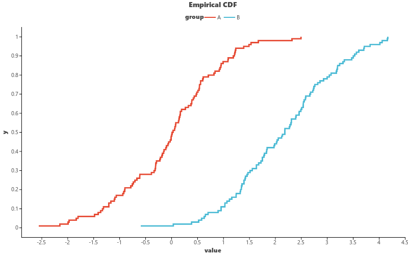

# ECDF Plot

Create empirical cumulative distribution function (ECDF) plots.

## Basic Usage

```python
import pandas as pd
import numpy as np
import letspubpy as lpp

np.random.seed(42)
df = pd.DataFrame({
    'value': np.random.normal(0, 1, 200)
})

p = lpp.ggecdf(df, x='value')
p.show()
```

## Grouped ECDF

```python
np.random.seed(42)
df = pd.DataFrame({
    'value': np.concatenate([
        np.random.normal(0, 1, 100),
        np.random.normal(2, 1, 100)
    ]),
    'group': ['A'] * 100 + ['B'] * 100
})

p = lpp.ggecdf(
    df, x='value',
    color='group', palette='npg'
)
```



## API

::: letspubpy.plots.ggecdf
    options:
        show_source: true

