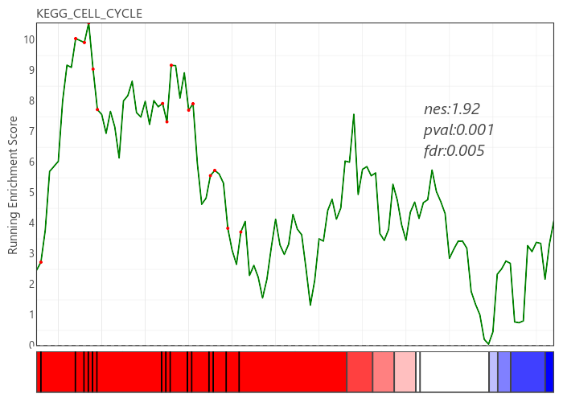
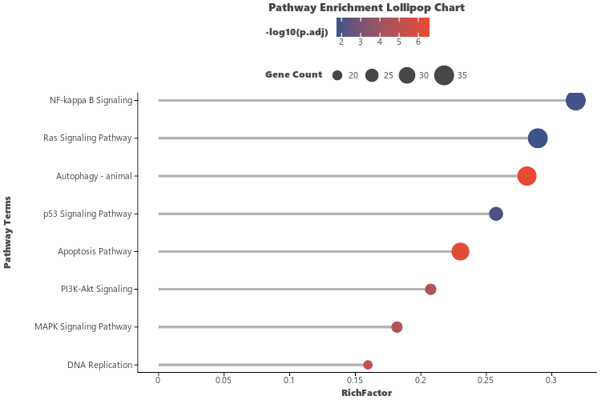
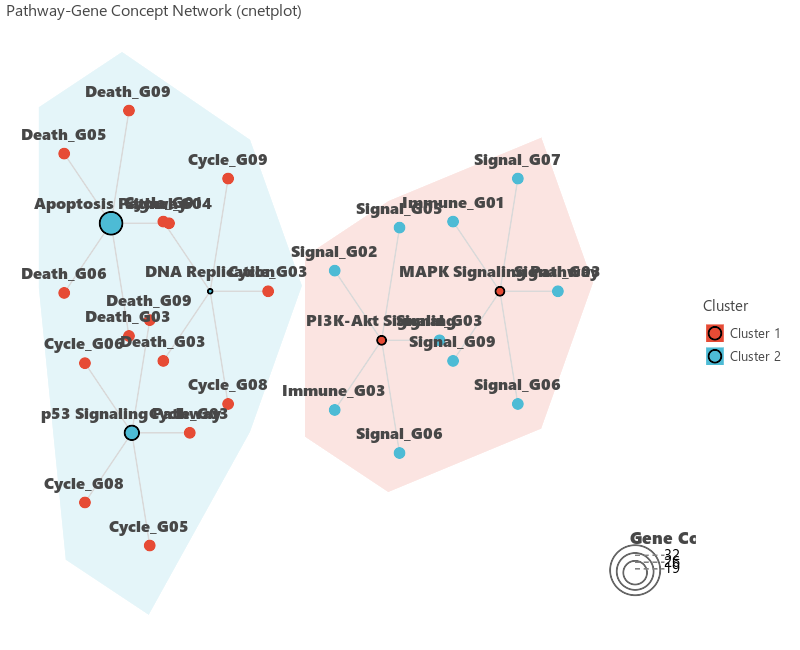

# GSEA & Pathway Enrichment Visualizations

`letspubpy` provides specialized, publication-grade visualizations for Gene Set Enrichment Analysis (GSEA) and Over-Representation Analysis (ORA / GO / KEGG / Reactome):

1. **GSEA Running Enrichment Plot (`visGSEA` / `gsea_plot` / `blitzgsea_plot`)**: Running enrichment score curve + hit barcode heatmap ribbon (`compute_heat_blocks`) + statistics annotations (NES, p-value, FDR) + interactive gene tooltips.
2. **Enrichment Lollipop Chart (`visEnrichLollipop` / `ggenrich_lollipop`)**: Significant pathway ranking with `-log10(p.adjust)` color gradient and gene count bubble sizing.
3. **Pathway-Gene Concept Network (`visEnrichNetwork` / `cnetplot`)**: Network diagram illustrating shared genes across enriched terms, convex cluster hulls (`show_hulls=True`), and concentric overlapping circle legends (`nested_legend=True`).

---

## 1. GSEA Running Enrichment Plot (`visGSEA` / `gsea_plot`)

### Basic GSEA Plot

```python
import letspubpy as lpp

# 1. Simulate synthetic GSEA prerank data (or pass real gseapy / blitzgsea results)
res_data, term, rnk = lpp.sim_gsea_data(
    n_genes=120,
    n_hits=15,
    nes=1.92,
    pval=0.0001,
    fdr=0.001,
    term="KEGG_CELL_CYCLE"
)

# 2. Generate GSEA enrichment plot
p_gsea = lpp.visGSEA(res_data, term=term, rnk=rnk)
p_gsea.show()
```



### Using with `blitzgsea` (`blitzgsea_plot` / `visBlitzGSEA`)

If you use `blitzgsea` for fast enrichment analysis:

```python
import letspubpy as lpp

# signature: DataFrame with columns ['gene', 'score']
# geneset: name of gene set (e.g. 'HALLMARK_HYPOXIA')
# library: dictionary mapping gene set names to lists of genes
# result: optional blitzgsea result table containing 'nes', 'pval', 'fdr'

p_blitz = lpp.blitzgsea_plot(
    signature=signature_df,
    geneset="HALLMARK_HYPOXIA",
    library=gmt_dict,
    result=result_df
)
p_blitz.show()
```

---

## 2. Enrichment Lollipop Chart (`visEnrichLollipop`)

Visualize ranked pathway enrichment results using a lollipop chart with color and size mappings:

```python
import letspubpy as lpp

# 1. Generate or load pathway enrichment table
df_enrich = lpp.sim_enrichment_data(n_terms=12)

# 2. Create Lollipop Chart
p_lollipop = lpp.visEnrichLollipop(
    df_enrich,
    top_n=10,
    x="RichFactor",
    color_by="p.adjust",
    size_by="Count",
    title="Pathway Enrichment Lollipop Chart",
    ylab="Pathway Terms"
)
p_lollipop.show()
```



---

## 3. Clustered Concept Network (`visEnrichNetwork` / `cnetplot`)

Visualize the shared gene overlap and functional clusters across enriched pathways:

```python
import letspubpy as lpp

# 1. Simulate or load pathway enrichment table
df_enrich = lpp.sim_enrichment_data(n_terms=9)

# 2. Create Clustered Concept Network
p_network = lpp.visEnrichNetwork(
    df_enrich,
    top_n=6,
    genes_per_term=4,
    cluster_pathways=True,    # Cluster pathways into functional modules
    n_clusters=3,             # 3 pathway clusters
    show_hulls=True,          # Draw convex hull boundaries around clusters
    pathway_size_by="Count",  # Pathway node size mapped to hit gene count
    nested_legend=True,       # Render concentric circle size legend
    cluster_palette="npg",    # Nature journal palette for cluster hulls
    title="Clustered Pathway Enrichment Concept Network (cnetplot)"
)
p_network.show()
```



---

## API Reference

### gsea_plot / visGSEA

::: letspubpy.plots.gsea_plot
    options:
        show_source: true

### blitzgsea_plot / visBlitzGSEA

::: letspubpy.plots.blitzgsea_plot
    options:
        show_source: true

### visEnrichLollipop

::: letspubpy.plots.visEnrichLollipop
    options:
        show_source: true

### visEnrichNetwork

::: letspubpy.plots.visEnrichNetwork
    options:
        show_source: true

### sim_gsea_data

::: letspubpy.plots.sim_gsea_data
    options:
        show_source: true

### sim_enrichment_data

::: letspubpy.plots.sim_enrichment_data
    options:
        show_source: true

### compute_heat_blocks

::: letspubpy.plots.compute_heat_blocks
    options:
        show_source: true
