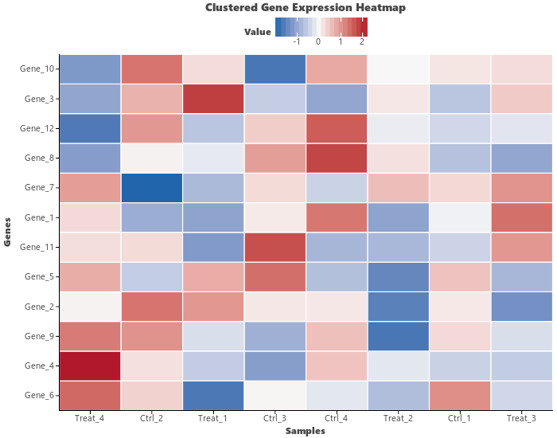

# Heatmap & Clustered Heatmap

`letspubpy` provides `ggheatmap` and `ggclustergram` (aliased as `ggclustervis` and `ggheatmap_cluster`) for generating publication-ready heatmaps and clustered heatmaps with hierarchical clustering, Z-score standardization, journal color palettes, and cell annotations.

---

## Key Features

- **Flexible Input Formats**: Accepts either a standard matrix DataFrame (index=genes/rows, columns=samples/timepoints) or long-format data (`x`, `y`, `fill`).
- **Hierarchical Clustering**: Perform row and/or column hierarchical clustering (`cluster_rows=True`, `cluster_cols=True`) using SciPy's distance metrics and linkage methods.
- **Data Standardization (Z-score)**: Scale rows (`scale="row"`), columns (`scale="column"`), or leave unscaled (`scale="none"`).
- **Publication Color Schemes**: Built-in diverging palettes (`bwr`, `coolwarm`, `rdbu`, `npg`, `nejm`, `viridis`, `magma`, `plasma`) or custom continuous color bounds (`low`, `mid`, `high`, `midpoint`).
- **Numeric Cell Labels**: Display values formatted with custom precision inside each tile (`show_values=True`, `digits=2`).
- **Cell Borders & Spacing**: Customizable grid borders (`cell_border="white"`, `cell_size=0.5`).

---

## Basic Usage

### 1. Matrix DataFrame Heatmap

Pass a numeric DataFrame where rows represent entities (e.g., genes or proteins) and columns represent conditions/samples:

```python
import numpy as np
import pandas as pd
import letspubpy as lpp

# Create sample matrix
np.random.seed(42)
genes = [f"Gene_{i+1}" for i in range(12)]
samples = [f"Sample_{j+1}" for j in range(8)]
mat = pd.DataFrame(
    np.random.randn(12, 8),
    index=genes,
    columns=samples
)

# Create basic heatmap with blue-white-red palette
p = lpp.ggheatmap(
    mat,
    palette="bwr",
    title="Gene Expression Heatmap",
    xlab="Samples",
    ylab="Genes"
)
p.show()
```

---

### 2. Clustered Heatmap (`ggclustervis` / `ggclustergram`)

Apply row and column hierarchical clustering with row Z-score scaling:

```python
# Clustered heatmap with row and column clustering
p_clustered = lpp.ggclustervis(
    mat,
    scale="row",            # Row Z-score standardization
    cluster_rows=True,      # Hierarchical clustering on rows
    cluster_cols=True,      # Hierarchical clustering on columns
    metric="euclidean",     # Distance metric (e.g. 'euclidean', 'correlation', 'cosine')
    method="complete",      # Linkage method (e.g. 'complete', 'ward', 'average')
    palette="bwr",          # Diverging Blue-White-Red color palette
    title="Clustered Expression Heatmap (Row Z-score)",
    xlab="Samples",
    ylab="Genes"
)
p_clustered.show()
```



> **Note**: `ggclustervis`, `ggclustergram`, and `ggheatmap_cluster` are equivalent convenience wrappers around `ggheatmap` with `cluster_rows=True`, `cluster_cols=True`, and `scale="row"` enabled by default.

---

### 3. Long-Format DataFrame

If your dataset is in "tidy" / long format with discrete columns for X, Y, and the fill value:

```python
df_long = pd.DataFrame({
    "Gene": ["GeneA", "GeneA", "GeneB", "GeneB", "GeneC", "GeneC"],
    "Condition": ["Ctrl", "Treat", "Ctrl", "Treat", "Ctrl", "Treat"],
    "Expression": [1.2, 3.4, 2.1, 0.8, -0.5, 2.3]
})

p_long = lpp.ggheatmap(
    df_long,
    x="Condition",
    y="Gene",
    fill="Expression",
    palette="coolwarm",
    title="Long-Format Heatmap"
)
p_long.show()
```

---

### 4. Displaying Numeric Cell Values

Show formatted numeric text values directly within heatmap tiles:

```python
p_annotated = lpp.ggheatmap(
    mat.iloc[:6, :5],
    show_values=True,
    digits=2,
    value_color="black",
    value_size=3.5,
    palette="rdbu",
    title="Heatmap with Value Annotations"
)
p_annotated.show()
```

---

### 5. Color Palettes and Custom Gradients

`letspubpy` supports multiple journal-grade and perceptual palettes:

```python
# Nature Publishing Group (NPG) palette
p_npg = lpp.ggheatmap(mat, scale="row", palette="npg", title="NPG Palette")

# New England Journal of Medicine (NEJM) palette
p_nejm = lpp.ggheatmap(mat, scale="row", palette="nejm", title="NEJM Palette")

# Perceptually uniform Viridis palette
p_viridis = lpp.ggheatmap(mat, palette="viridis", title="Viridis Palette")

# Custom three-color gradient with custom midpoint
p_custom = lpp.ggheatmap(
    mat,
    scale="row",
    low="#2E7D32",     # Green for down-regulation
    mid="#FFFFFF",     # White for baseline
    high="#C2185B",    # Pink/Red for up-regulation
    midpoint=0.0,
    title="Custom Green-White-Magenta Palette"
)
```

---

### 6. Customizing Borders and Themes

```python
p_styled = lpp.ggheatmap(
    mat,
    scale="row",
    cell_border="#333333",   # Dark cell borders
    cell_size=0.8,           # Thicker border width
    palette="bwr",
    show_legend=True,
    ggtheme=lpp.theme_pubr(border=True)
)
p_styled.show()
```

---

## API Reference

### ggheatmap

::: letspubpy.plots.ggheatmap
    options:
        show_source: true

### ggclustergram

::: letspubpy.plots.ggclustergram
    options:
        show_source: true
