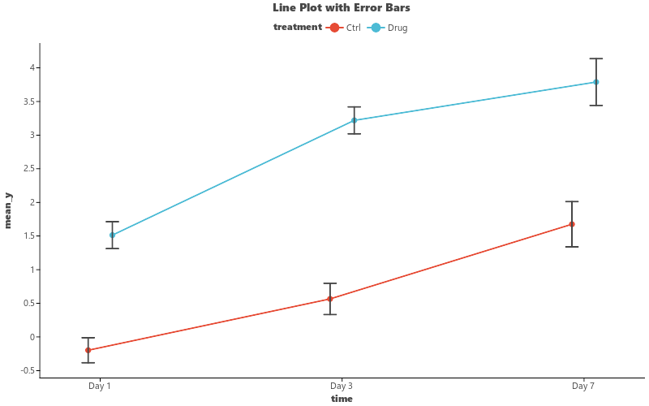

# Line Plot

Create line plots showing group means over a continuous or categorical x-axis.

## Basic Usage

```python
import pandas as pd
import numpy as np
import letspubpy as lpp

np.random.seed(42)
df = pd.DataFrame({
    'time': ['Day 1'] * 20 + ['Day 3'] * 20 + ['Day 7'] * 20,
    'treatment': ['Ctrl'] * 10 + ['Drug'] * 10 +
                 ['Ctrl'] * 10 + ['Drug'] * 10 +
                 ['Ctrl'] * 10 + ['Drug'] * 10,
    'value': np.concatenate([
        np.random.normal(0, 1, 10), np.random.normal(2, 1, 10),
        np.random.normal(0.5, 1, 10), np.random.normal(3, 1, 10),
        np.random.normal(1, 1, 10), np.random.normal(4, 1, 10),
    ])
})

p = lpp.ggline(df, x='time', y='value', color='treatment', palette='npg')
p.show()
```

## Adding Error Bars

```python
# Mean ± SEM
p = lpp.ggline(
    df, x='time', y='value',
    color='treatment', palette='npg',
    add='mean_se'
)
```



## API

::: letspubpy.plots.ggline
    options:
        show_source: true

