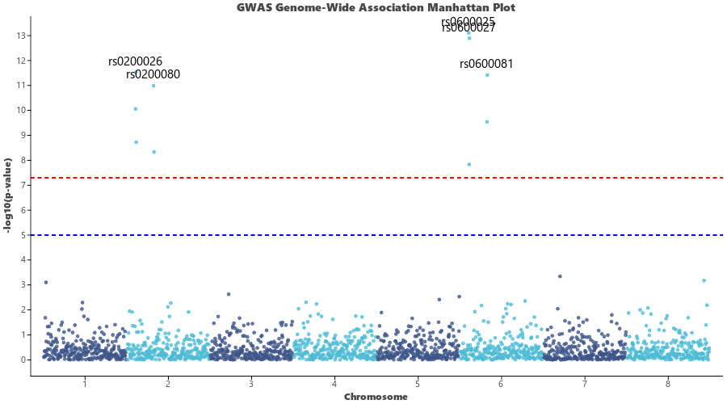

# GWAS Manhattan Plot (`ggmanhattan`)

`ggmanhattan` (aliased as `visManhattan`) creates publication-ready **Manhattan Plots** for Genome-Wide Association Studies (GWAS) and chromosomal variation mapping.

---

## Key Features

- **Alternating Chromosome Coloring**: Alternates colors between consecutive chromosome blocks across the genome.
- **Genome-Wide Significance Thresholds**: Built-in dashed reference lines for genome-wide significance ($5 \times 10^{-8}$) and suggestive significance ($1 \times 10^{-5}$).
- **Top Lead SNP Annotations**: Automatically annotates lead variants with SNP identifiers (`top_snps=5`).

---

## Usage Examples

### 1. Basic GWAS Manhattan Plot

```python
import letspubpy as lpp

# Simulate and plot GWAS genome-wide association data
p = lpp.ggmanhattan(
    suggestive_line=1e-5,
    genomewide_line=5e-8,
    top_snps=5,
    title="GWAS Genome-Wide Association Manhattan Plot",
    xlab="Chromosome",
    ylab="-log10(p-value)"
)
p.show()
```



---

### 2. Custom GWAS Summary Statistics

```python
import pandas as pd
import letspubpy as lpp

df_gwas = pd.DataFrame({
    "chr": [1, 1, 1, 2, 2, 2, 3, 3],
    "bp": [10000, 25000, 50000, 12000, 34000, 89000, 23000, 78000],
    "pvalue": [0.05, 1e-9, 0.01, 1e-4, 1e-12, 0.5, 0.02, 1e-6],
    "snp": ["rs01", "rs02_Lead", "rs03", "rs04", "rs05_Lead", "rs06", "rs07", "rs08"]
})

p_custom = lpp.ggmanhattan(
    df_gwas,
    chr="chr",
    bp="bp",
    p="pvalue",
    snp="snp",
    top_snps=2,
    title="Candidate Loci Manhattan Plot"
)
p_custom.show()
```

---

## API Reference

### ggmanhattan

::: letspubpy.plots.ggmanhattan
    options:
        show_source: true

### sim_gwas_data

::: letspubpy.plots.sim_gwas_data
    options:
        show_source: true
