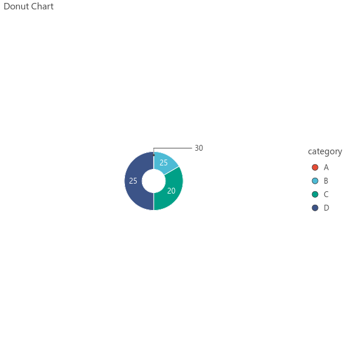

# Pie & Donut Charts

Create pie and donut charts for categorical data visualization.

## Pie Chart

```python
import pandas as pd
import letspubpy as lpp

df = pd.DataFrame({
    'category': ['A', 'B', 'C', 'D'],
    'count': [30, 25, 20, 25]
})

p = lpp.ggpie(df, x='category', label='count', fill='category', palette='npg')
p.show()
```


## Donut Chart

```python
p = lpp.ggdonutchart(
    df, x='category', label='count',
    fill='category', palette='npg',
    hole=0.4
)
```



## API

::: letspubpy.plots.ggpie
    options:
        show_source: true


::: letspubpy.plots.ggdonutchart
    options:
        show_source: true

