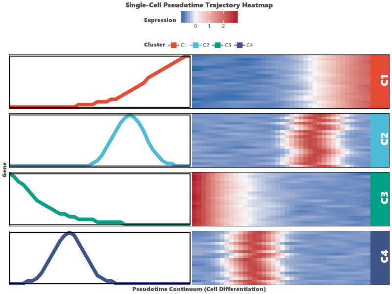

# Pseudotime Trajectory Heatmap (`visPseudotime`)

`visPseudotime` (aliased as `ggpseudotime`) provides **Monocle-style** single-cell RNA-seq pseudotime trajectory heatmaps, displaying continuous gene expression dynamics along cell differentiation trajectories.

---

## Key Features

- **Monocle-style Single-Cell Visualizations**: Visualize gene expression dynamics across cell progression pseudotime.
- **Built-in Trajectory Simulation**: Includes `sim_pseudotime_data()` for generating high-quality synthetic scRNA-seq pseudotime matrices with customizable clusters (Early response, Mid pulse, Late terminal differentiation) and smooth Gaussian-filtered expression curves.
- **Cluster Partitioning**: Group pseudotime dynamics into distinct temporal response modules (`n_clusters=4`).
- **Flexible Styling**: Full control over gradient palettes (`palette="bwr"`), cluster annotations (`cluster_palette="npg"`), and Z-score scaling (`scale="row"`).

---

## Usage Examples

### 1. Simulated Pseudotime Trajectory Heatmap

When `data=None`, `visPseudotime` automatically simulates realistic scRNA-seq pseudotime data:

```python
import letspubpy as lpp

# Automatically simulate and plot single-cell pseudotime trajectory heatmap
p = lpp.visPseudotime(
    n_clusters=4,
    scale="row",
    palette="bwr",
    cluster_palette="npg",
    title="Monocle Single-Cell Pseudotime Trajectory Heatmap",
    xlab="Pseudotime Continuum (Cell Differentiation)",
    ylab="Dynamic Marker Genes"
)
p.show()
```



---

### 2. Custom Pseudotime Expression Data

Pass your own matrix where rows are dynamic genes and columns are ordered pseudotime points or single cells:

```python
import letspubpy as lpp

# Simulate custom 6-cluster pseudotime matrix (120 genes x 60 pseudotime bins)
df_pseudo = lpp.sim_pseudotime_data(
    n_genes=120,
    n_pts=60,
    n_clusters=6,
    seed=42
)

# Plot pseudotime heatmap partitioned into 6 temporal modules
p_custom = lpp.visPseudotime(
    data=df_pseudo,
    n_clusters=6,
    scale="row",
    palette="coolwarm",
    cluster_palette="nejm",
    title="Single-Cell Lineage Differentiation Heatmap"
)
p_custom.show()
```

---

## API Reference

### visPseudotime

::: letspubpy.plots.visPseudotime
    options:
        show_source: true

### sim_pseudotime_data

::: letspubpy.plots.sim_pseudotime_data
    options:
        show_source: true
