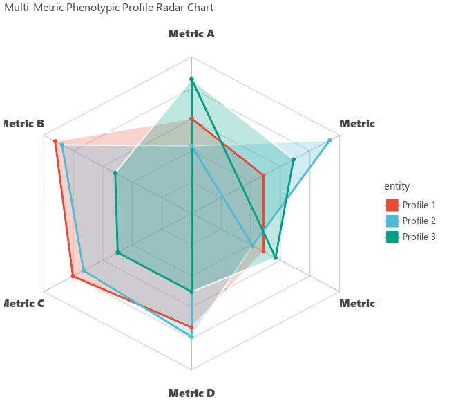

# Radar & Spider Chart (`ggradar`)

`ggradar` (aliased as `visRadar`) creates polygonal **Radar / Spider Charts** for comparing multi-dimensional phenotypes, biomarker signatures, or model benchmark profiles.

---

## Key Features

- **Concentric Grid Webs**: Automatically draws polygonal concentric grid guides (20%, 40%, 60%, 80%, 100%) and spoke rays.
- **Multi-Profile Overlays**: Compare multiple entities/groups with transparent fills (`alpha=0.25`) and journal color palettes (`palette="npg"`).
- **Flexible Numeric Scales**: Scales any number of positive metrics into a standardized geometric polygon.

---

## Usage Examples

### 1. Basic Radar Chart

```python
import letspubpy as lpp

# Simulate and plot multi-metric phenotypic profile radar chart
p = lpp.ggradar(
    palette="npg",
    alpha=0.25,
    title="Multi-Metric Phenotypic Profile Radar Chart"
)
p.show()
```



---

### 2. Custom Biomarker Signature Comparison

```python
import pandas as pd
import letspubpy as lpp

df_models = pd.DataFrame({
    "Model": ["Transformer", "CNN", "RandomForest"],
    "Accuracy": [94.5, 88.0, 82.0],
    "Precision": [92.0, 86.5, 80.0],
    "Recall": [96.0, 89.0, 85.0],
    "F1_Score": [94.0, 87.7, 82.4],
    "AUC": [98.2, 91.5, 87.0],
    "Speed": [75.0, 95.0, 90.0]
})

p_models = lpp.ggradar(
    df_models,
    id="Model",
    max_scale=100.0,
    palette="npg",
    title="Classifier Benchmark Performance"
)
p_models.show()
```

---

## API Reference

### ggradar

::: letspubpy.plots.ggradar
    options:
        show_source: true

### sim_radar_data

::: letspubpy.plots.sim_radar_data
    options:
        show_source: true
