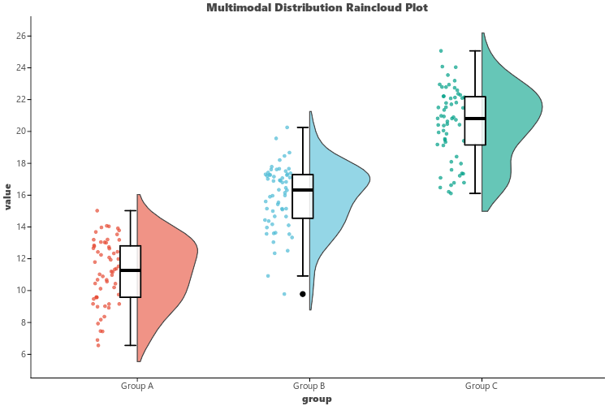

# Raincloud Plot (`ggraincloud`)

`ggraincloud` (aliased as `visRaincloud`) creates **Raincloud Plots**, an acclaimed modern visualization recommended by *Nature Methods* that combines a half-violin kernel density curve ("cloud"), raw jittered sample points ("rain"), and an embedded boxplot ("lightning").

---

## Key Features

- **Three-in-One Distribution Representation**:
  - **Cloud**: Smooth non-parametric half-violin kernel density estimate.
  - **Rain**: Unaggregated individual raw data points with horizontal jitter.
  - **Lightning**: Central summary boxplot showing medians and quartiles.
- **Journal Color Schemes**: Supports Nature (`npg`), NEJM (`nejm`), Science (`aaas`), and JCO (`jco`).
- **Flexible Styling**: Customizable cloud width (`cloud_width`), jitter spread (`rain_jitter`), and box width (`box_width`).

---

## Usage Examples

### 1. Basic Raincloud Plot

```python
import letspubpy as lpp

# Simulate and plot multimodal distribution raincloud
p = lpp.ggraincloud(
    palette="npg",
    cloud_width=0.35,
    rain_jitter=0.08,
    box_width=0.12,
    title="Multimodal Distribution Raincloud Plot",
    xlab="Experimental Group",
    ylab="Measured Values"
)
p.show()
```



---

### 2. Custom Experimental Dataset

```python
import numpy as np
import pandas as pd
import letspubpy as lpp

np.random.seed(42)
df = pd.DataFrame({
    "Condition": ["Control"] * 50 + ["Drug A"] * 50 + ["Drug B"] * 50,
    "Response": np.concatenate([
        np.random.normal(12.0, 2.0, 50),
        np.random.normal(18.5, 3.0, 50),
        np.random.normal(15.0, 1.5, 50)
    ])
})

p_custom = lpp.ggraincloud(
    df,
    x="Condition",
    y="Response",
    palette="nejm",
    title="Drug Screening Raincloud Plot"
)
p_custom.show()
```

---

## API Reference

### ggraincloud

::: letspubpy.plots.ggraincloud
    options:
        show_source: true

### sim_raincloud_data

::: letspubpy.plots.sim_raincloud_data
    options:
        show_source: true
