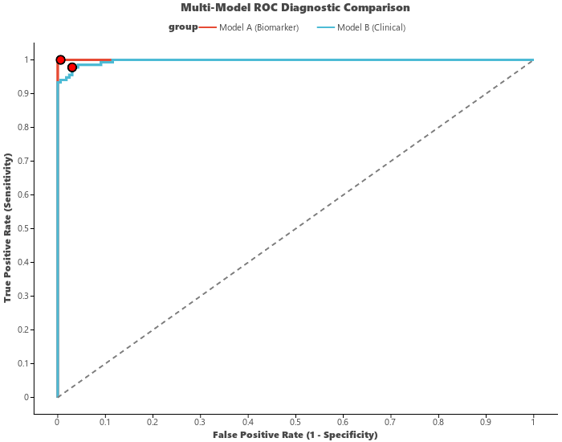

# ROC & Precision-Recall Curves (`ggroc`)

`ggroc` (aliased as `visROC`) creates publication-grade **Receiver Operating Characteristic (ROC)** and **Precision-Recall (PRC)** curves for evaluating diagnostic biomarkers and binary machine learning classifiers.

---

## Key Features

- **Automated AUC Calculation**: Computes exact trapezoidal Area Under the Curve (AUC) and formats it into labels/titles (`show_auc=True`).
- **Dual Evaluation Modes**: Supports ROC curves (`plot_type="roc"`) and Precision-Recall curves (`plot_type="prc"`).
- **Optimal Cutoff Detection**: Automatically determines and marks the optimal threshold point via Youden's J statistic ($\max(\text{TPR} - \text{FPR})$) (`mark_optimal=True`).
- **Multi-Model Comparison**: Easily overlay and compare multiple diagnostic models or biomarkers with journal palettes (`palette="npg"`).

---

## Usage Examples

### 1. Multi-Model ROC Comparison

```python
import letspubpy as lpp

# Simulate and plot multi-model ROC diagnostic curve
p = lpp.ggroc(
    plot_type="roc",
    palette="npg",
    show_auc=True,
    mark_optimal=True,
    title="Multi-Model ROC Diagnostic Comparison"
)
p.show()
```



---

### 2. Precision-Recall Curve (PRC)

```python
# Precision-Recall evaluation for imbalanced datasets
p_prc = lpp.ggroc(
    plot_type="prc",
    palette="nejm",
    title="Precision-Recall Evaluation"
)
p_prc.show()
```

---

### 3. Custom Evaluation Data

```python
import numpy as np
import pandas as pd
import letspubpy as lpp

df_eval = pd.DataFrame({
    "true_label": [1, 0, 1, 1, 0, 0, 1, 0, 1, 0],
    "predicted_prob": [0.92, 0.15, 0.81, 0.74, 0.32, 0.08, 0.65, 0.41, 0.88, 0.22]
})

p_custom = lpp.ggroc(
    df_eval,
    y_true="true_label",
    y_score="predicted_prob",
    title="Biomarker Diagnostic Efficacy"
)
p_custom.show()
```

---

## API Reference

### ggroc

::: letspubpy.plots.ggroc
    options:
        show_source: true

### sim_roc_data

::: letspubpy.plots.sim_roc_data
    options:
        show_source: true
