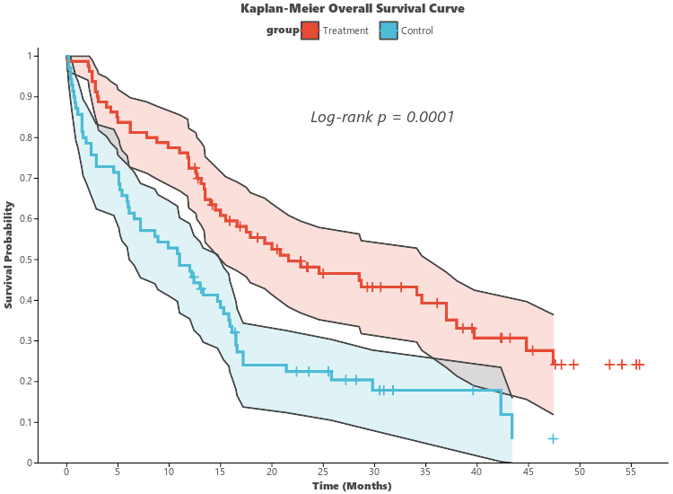

# Kaplan-Meier Survival Plot (`ggsurvplot`)

`ggsurvplot` (aliased as `visSurvival`) generates publication-grade **Kaplan-Meier survival curves** for oncology and clinical research, featuring step functions, Greenwood confidence interval ribbons, censoring tick marks, and automated Log-rank statistical hypothesis testing.

---

## Key Features

- **Standard Kaplan-Meier Step Curves**: Precise step-function survival probability calculations over follow-up time.
- **95% Greenwood Confidence Intervals**: Optional smooth confidence interval ribbons (`conf_int=True`).
- **Censored Event Ticks**: Automatic markers (`+`) for right-censored patients/samples (`censored_ticks=True`).
- **Automated Log-Rank Test**: Computes two-sided log-rank test statistic $\chi^2$ and formats $p$-value directly on the figure (`log_rank=True`).
- **Multi-Group Stratification**: Compare treatment arms, mutation statuses, or risk cohorts with journal palettes (`palette="npg"`).

---

## Usage Examples

### 1. Basic Survival Curve with Log-Rank Test

```python
import letspubpy as lpp

# Automatically simulate clinical survival cohort
p = lpp.ggsurvplot(
    time="time",
    status="status",
    group="group",
    palette="npg",
    conf_int=True,
    censored_ticks=True,
    log_rank=True,
    title="Kaplan-Meier Overall Survival Curve",
    xlab="Time (Months)",
    ylab="Overall Survival Probability"
)
p.show()
```



---

### 2. Custom Clinical Cohort Data

```python
import pandas as pd
import letspubpy as lpp

df_cohort = pd.DataFrame({
    "months": [4.5, 8.2, 12.0, 15.6, 24.1, 30.5, 6.1, 14.3, 19.8, 28.0],
    "event": [1, 1, 0, 1, 0, 1, 1, 0, 1, 0],   # 1 = Death / Event, 0 = Censored
    "arm": ["Arm A", "Arm A", "Arm A", "Arm A", "Arm A", "Arm B", "Arm B", "Arm B", "Arm B", "Arm B"]
})

p_cohort = lpp.ggsurvplot(
    df_cohort,
    time="months",
    status="event",
    group="arm",
    palette="nejm",
    title="Clinical Trial Cohort Survival"
)
p_cohort.show()
```

---

## API Reference

### ggsurvplot

::: letspubpy.plots.ggsurvplot
    options:
        show_source: true

### sim_survival_data

::: letspubpy.plots.sim_survival_data
    options:
        show_source: true
