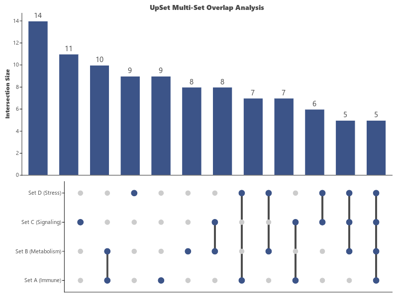

# UpSet Set Intersection Plot (`ggupset`)

`ggupset` (aliased as `visUpSet`) creates **UpSet Plots** for visualizing complex set intersections, overlaps, and multi-omics gene set memberships, providing a superior alternative to Venn diagrams when comparing $\ge 3$ sets.

---

## Key Features

- **Multi-Panel Visualization**:
  - **Top Bar Chart**: Shows the exact size of each non-empty subset intersection.
  - **Bottom Dot Matrix**: Visualizes set membership with connected dot patterns.
- **Sorted by Subset Frequency**: Automatically sorts intersection combinations from largest to smallest.
- **Customizable Thresholds**: Filter out rare subsets (`min_size=1`, `top_n=12`).

---

## Usage Examples

### 1. Basic UpSet Plot

```python
import letspubpy as lpp

# Simulate and plot multi-set intersection overlaps
p = lpp.ggupset(
    min_size=1,
    top_n=10,
    title="UpSet Multi-Set Overlap Analysis"
)
p.show()
```



---

### 2. Custom Gene Set Overlaps

```python
import pandas as pd
import letspubpy as lpp

df_sets = pd.DataFrame({
    "gene": [f"Gene_{i+1}" for i in range(10)],
    "Apoptosis":  [1, 1, 1, 0, 0, 0, 1, 0, 0, 1],
    "Cell_Cycle": [1, 1, 0, 1, 1, 0, 0, 0, 1, 0],
    "DNA_Repair": [1, 0, 1, 1, 0, 1, 0, 0, 0, 1],
    "Metabolism": [0, 0, 0, 0, 1, 1, 1, 1, 0, 0]
})

p_upset = lpp.ggupset(
    df_sets,
    sets=["Apoptosis", "Cell_Cycle", "DNA_Repair", "Metabolism"],
    title="Pathway Gene Membership Intersections"
)
p_upset.show()
```

---

## API Reference

### ggupset

::: letspubpy.plots.ggupset
    options:
        show_source: true

### sim_upset_data

::: letspubpy.plots.sim_upset_data
    options:
        show_source: true
