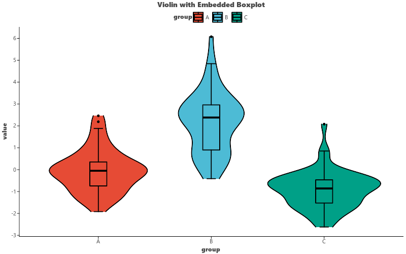

# Violin Plot

Create violin plots showing density distribution, with optional embedded boxplots.

## Basic Usage

```python
import pandas as pd
import numpy as np
import letspubpy as lpp

np.random.seed(42)
df = pd.DataFrame({
    'group': ['A'] * 50 + ['B'] * 50 + ['C'] * 50,
    'value': np.concatenate([
        np.random.normal(0, 1, 50),
        np.random.normal(2, 1.5, 50),
        np.random.normal(-1, 0.8, 50)
    ])
})

p = lpp.ggviolin(df, x='group', y='value', fill='group', palette='npg')
p.show()
```



## With Inner Boxplot

```python
p = lpp.ggviolin(
    df, x='group', y='value',
    fill='group', palette='nejm',
    add='boxplot'  # Embedded boxplot inside violin
)
```

## With Individual Points

```python
p = lpp.ggviolin(
    df, x='group', y='value',
    fill='group',
    add='jitter', add_params={'width': 0.1}
)
```

## Drawing Quantile Lines

```python
p = lpp.ggviolin(
    df, x='group', y='value',
    draw_quantiles=[0.25, 0.5, 0.75]
)
```

## API

::: letspubpy.plots.ggviolin
    options:
        show_source: true

