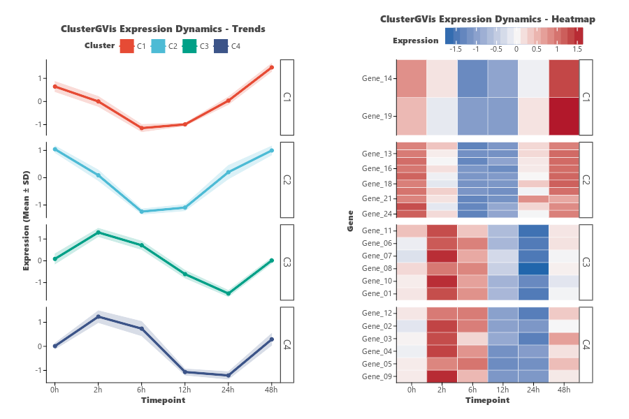

# Cluster Trend Dual-View (`visCluster`)

`visCluster` (aliased as `ggvisCluster`) provides **ClusterGVis-style** multi-panel visualizations, seamlessly integrating clustered gene/protein heatmaps with cluster-specific dynamic expression trend curves.

---

## Key Features

- **Side-by-Side Dual View**: Automatically generates a split visualization showing clustered heatmap tiles along with smoothed average cluster expression trajectories (`plot_type="both"`).
- **Flexible Layouts**: Render dual-view (`"both"`), heatmap-only (`"heatmap"`), or trend lines-only (`"line"`).
- **Trend Position Control**: Position cluster trend profiles on the left or right side (`trend_position="left"` or `"right"`).
- **Clustering Algorithms**: Choose between Hierarchical Clustering (`cluster_method="hierarchical"`) and K-Means (`cluster_method="kmeans"`).
- **Custom Cluster Groups**: Partition genes/proteins into any number of clusters (`n_clusters=4`).
- **Independent Color Palettes**: Apply distinct palettes for heatmap gradient tiles (`palette="bwr"`) and cluster trend groupings (`cluster_palette="npg"`).
- **Large Dataset Optimization**: Built-in automatic binning for high-dimensional single-cell or longitudinal data (>150 cells/points) for optimal rendering performance.

---

## Usage Examples

### 1. Multi-Condition / Time Series Cluster Analysis

```python
import numpy as np
import pandas as pd
import letspubpy as lpp

# Generate synthetic time-series expression data (24 genes x 6 time points)
np.random.seed(42)
genes = [f"Gene_{i+1:02d}" for i in range(24)]
timepoints = ["0h", "2h", "6h", "12h", "24h", "48h"]

t = np.linspace(0, 2 * np.pi, 6)
p1 = np.sin(t)        # Early response peak
p2 = np.cos(t)        # Late response peak
p3 = np.exp(-t)       # Continuous decrease
p4 = 1 - np.exp(-t)   # Continuous increase

data = []
for i in range(24):
    if i < 6: pattern = p1
    elif i < 12: pattern = p2
    elif i < 18: pattern = p3
    else: pattern = p4
    data.append(pattern + np.random.normal(0, 0.2, 6))

df_mat = pd.DataFrame(data, index=genes, columns=timepoints)

# Create dual-view cluster heatmap and trend lines
p = lpp.visCluster(
    df_mat,
    n_clusters=4,           # Partition into 4 expression clusters
    scale="row",            # Row Z-score standardization
    plot_type="both",       # Display both heatmap and trend lines
    trend_position="left",  # Trend plots positioned on the left
    palette="bwr",          # Blue-White-Red heatmap gradient
    cluster_palette="npg",  # Nature journal palette for cluster groups
    title="ClusterGVis Expression Dynamics",
    xlab="Time Point"
)
p.show()
```



---

### 2. K-Means Clustering

```python
# Use K-Means clustering algorithm instead of hierarchical clustering
p_kmeans = lpp.visCluster(
    df_mat,
    n_clusters=3,
    cluster_method="kmeans",
    scale="row",
    plot_type="both",
    cluster_palette="aaas",   # Science journal color palette
    palette="coolwarm",
    title="K-Means Clustered Expression Profile"
)
p_kmeans.show()
```

---

### 3. Displaying Trend Lines Only or Heatmap Only

```python
# Trend lines only
p_lines = lpp.visCluster(
    df_mat,
    n_clusters=4,
    plot_type="line",
    cluster_palette="jco",    # Journal of Clinical Oncology palette
    title="Cluster Expression Trajectories"
)
p_lines.show()

# Heatmap only with cluster facets
p_heatmap = lpp.visCluster(
    df_mat,
    n_clusters=4,
    plot_type="heatmap",
    palette="bwr",
    title="Clustered Expression Heatmap by Module"
)
p_heatmap.show()
```

---

## API Reference

### visCluster

::: letspubpy.plots.visCluster
    options:
        show_source: true
