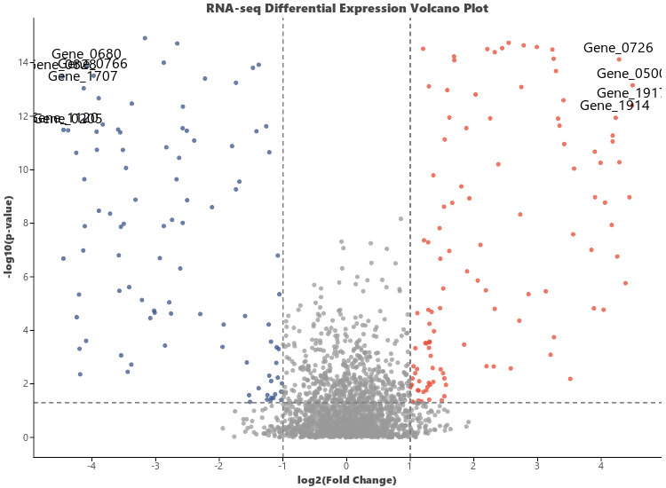

# Volcano Plot (`ggvolcano`)

`ggvolcano` (aliased as `visVolcano`) provides a publication-ready volcano plot for visualizing differential expression analysis (RNA-seq, Proteomics, Metabolomics, Microarrays).

---

## Key Features

- **Automatic Classification**: Classifies features into Up-regulated (Red), Down-regulated (Blue), and Not Significant (Gray) based on $\log_2(\text{Fold Change})$ and $p$-value / FDR thresholds.
- **Adjustable Thresholds**: Easily customize fold change cutoffs (`fc_cutoff=1.0`) and statistical significance cutoffs (`p_cutoff=0.05`).
- **Top Significant Gene Annotations**: Automatically annotates the top $N$ most significant features with gene labels (`top_n=10`).
- **Flexible Data Input**: Accepts user differential expression dataframes or generates realistic synthetic data via `sim_volcano_data()`.

---

## Usage Examples

### 1. Basic Volcano Plot with Simulated Data

```python
import letspubpy as lpp

# Automatically simulates realistic differential expression data
p = lpp.ggvolcano(
    fc_cutoff=1.0,
    p_cutoff=0.05,
    top_n=10,
    title="RNA-seq Differential Expression Volcano Plot",
    xlab="log2(Fold Change)",
    ylab="-log10(p-value)"
)
p.show()
```



---

### 2. Custom Differential Expression Data

```python
import pandas as pd
import letspubpy as lpp

# Load or prepare differential expression table
df_de = pd.DataFrame({
    "gene": ["TP53", "EGFR", "MYC", "BRCA1", "GAPDH", "ACTB"],
    "log2FC": [2.8, -3.1, 1.9, -0.2, 0.05, -0.02],
    "pvalue": [1e-8, 1e-12, 1e-4, 0.45, 0.92, 0.88]
})

p_custom = lpp.ggvolcano(
    df_de,
    x="log2FC",
    y="pvalue",
    label="gene",
    fc_cutoff=1.5,
    p_cutoff=0.01,
    top_n=3,
    title="Target Gene Volcano Plot"
)
p_custom.show()
```

---

## API Reference

### ggvolcano

::: letspubpy.plots.ggvolcano
    options:
        show_source: true

### sim_volcano_data

::: letspubpy.plots.sim_volcano_data
    options:
        show_source: true
