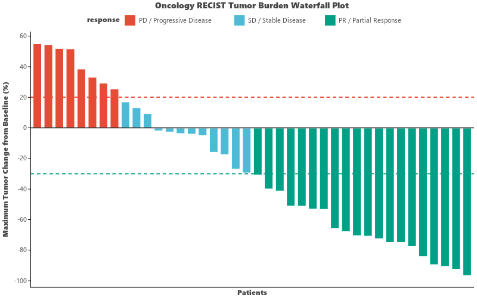

# Waterfall Plot (`ggwaterfall`)

`ggwaterfall` (aliased as `visWaterfall`) generates oncology and clinical **RECIST Waterfall Plots** for visualizing best overall response / percentage change in tumor burden across patients.

---

## Key Features

- **RECIST Clinical Threshold Lines**: Built-in dashed reference lines for Partial Response (PR, $-30\%$) and Progressive Disease (PD, $+20\%$).
- **Flexible Ordering**: Sort patients by tumor shrinkage / growth in descending (`order="desc"`) or ascending order.
- **Categorical Response Grouping**: Color bars by clinical response categories (CR, PR, SD, PD) or genetic mutation subtypes (`palette="npg"`).

---

## Usage Examples

### 1. Basic RECIST Tumor Burden Waterfall Plot

```python
import letspubpy as lpp

# Simulate and plot oncology RECIST waterfall plot
p = lpp.ggwaterfall(
    order="desc",
    pr_cutoff=-30.0,
    pd_cutoff=20.0,
    palette="npg",
    title="Oncology RECIST Tumor Burden Waterfall Plot",
    xlab="Patients",
    ylab="Maximum Tumor Change from Baseline (%)"
)
p.show()
```



---

### 2. Custom Clinical Cohort Data

```python
import pandas as pd
import letspubpy as lpp

df_patients = pd.DataFrame({
    "patient_id": [f"Pt_{i+1:02d}" for i in range(12)],
    "change": [-85.0, -60.0, -45.0, -32.0, -15.0, -5.0, 4.0, 12.0, 18.0, 25.0, 40.0, 65.0],
    "response": ["PR", "PR", "PR", "PR", "SD", "SD", "SD", "SD", "SD", "PD", "PD", "PD"]
})

p_cohort = lpp.ggwaterfall(
    df_patients,
    x="patient_id",
    y="change",
    group="response",
    title="Clinical Trial Best Percentage Change in Target Lesions"
)
p_cohort.show()
```

---

## API Reference

### ggwaterfall

::: letspubpy.plots.ggwaterfall
    options:
        show_source: true

### sim_waterfall_data

::: letspubpy.plots.sim_waterfall_data
    options:
        show_source: true
